# InternetOfThings Telegram Todo - Larissa van Rijn

<H1> Telegram</H1> 

In deze manual ga je de volgende stappen doorlopen om zo goed mogelijk een telegram te maken.
De bron van deze stappen is afkomstig van: 

<H2>Wat je nodig hebt:</H2>
<ol>
  <li>Ins</li>
  <li></li>
  <li>S</li>
</ol>

<H2>Stap 1: App installeren en gereed maken</H2>
<ol>
  <li>Ga op je telefoon naar de google / apple store en download de applicatie: Telegram. </li>
  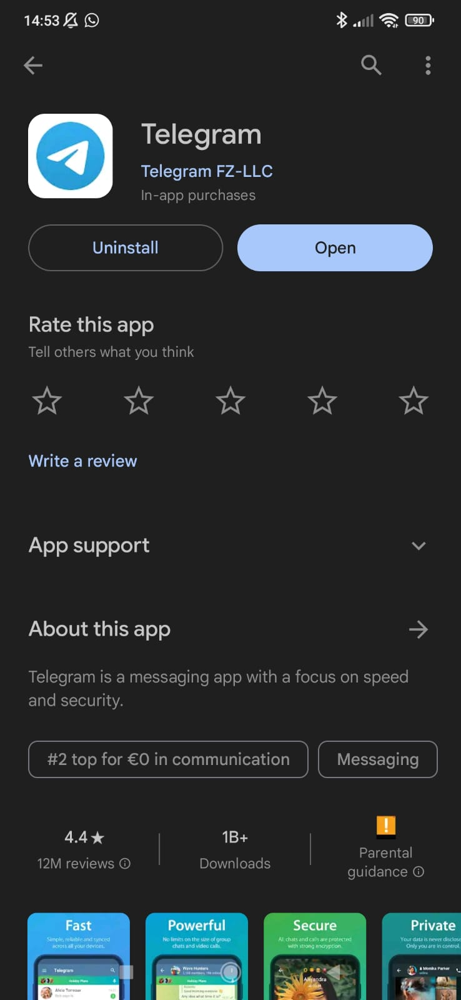
   

  <li> Maak vervolgens jouw account aan en wanneer deze gereed is, klik je op het zoek icoontje rechts bovenin. </li>
  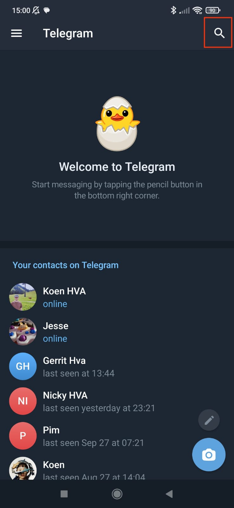
   

  <li> Zoek vervolgens op: botfather en klik op het account. </li>
  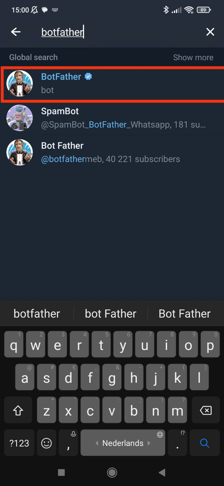
   

   <li> Als deze geopend is, klik dan op start.</li>
  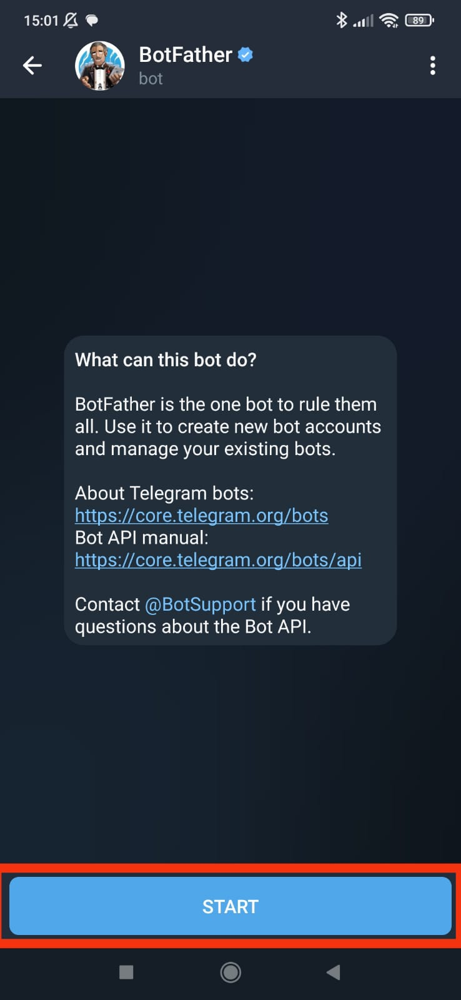
   

  <li> Typ nu in: /newbot in je tekstvlak en verstuur deze. Maak nu een naam en een username aan voor jouw bot.</li>
  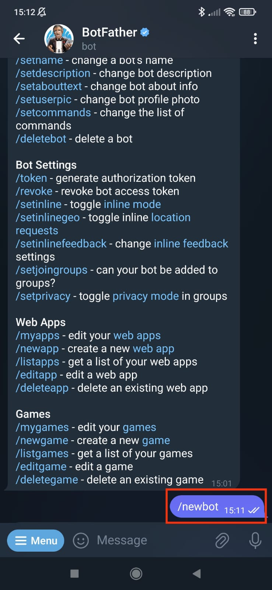
   

  <li> Als deze beschikbaar is en, krijg je een berichtje met je een link voor access voor jouw bot en een bot token. Sla deze bot token ergens op, zodat je deze later kan invoeren voor je Arduino Board.</li>
  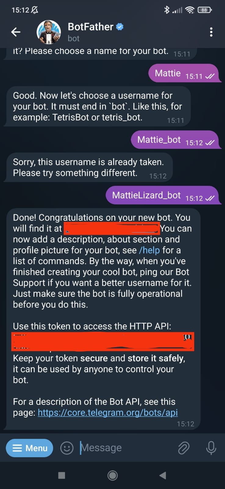
   
  
</ol>

<H2>Stap 2: Telegram User ID</H2>
<ol>
  <li>Ga naar je telegram account en zoek voor IDBot. Ik kon deze optie niet vinden, dus heb ik deze link gekopiert en geplakt in mijn mobiel: t.me/myidbot . Klik vervolgens op START</li>
  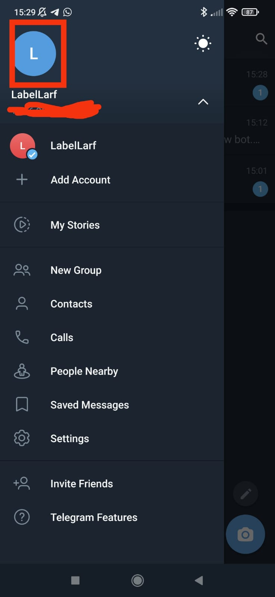
  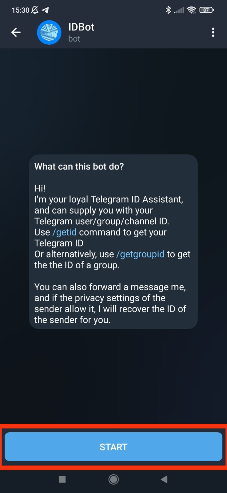
   

  <li>Typ vervolgens: /getid . Je krijgt nu een User ID, ook deze moet je opslaan voor later.</li>
  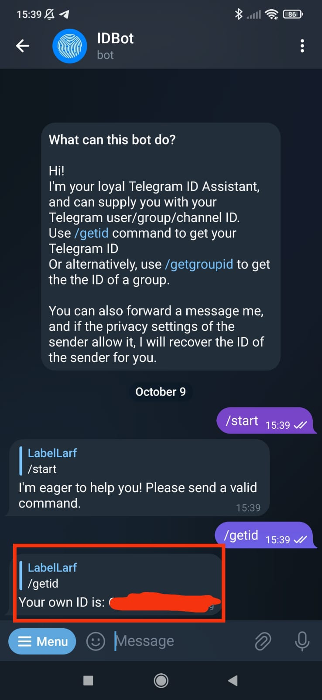
   
  
</ol>

<H2>Stap 3: Arduino klaar zetten</H2>
<ol>
  <li>Het is belangrijk om voor deze stap de Universal Arduino Telegram Bot Library te dowloaden in jouw Arduino appliactie op jouw computer. Om deze te dowloaden ga je naar: Sketch > Include Library > Add.ZIP Library | en gebruik je deze zip file: <a>https://github.com/witnessmenow/Universal-Arduino-Telegram-Bot/archive/master.zip| Om deze te installeren.</a></li>
  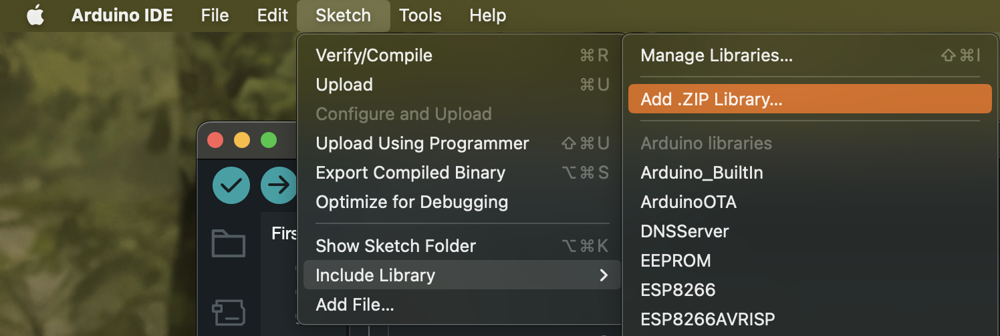
   

  <li>Installeer ook de ArduinoJson Library. Ga naar Skech > Include Library > Manage Libraries | en zoek voor: ArduinoJson en installeer deze.</li>
  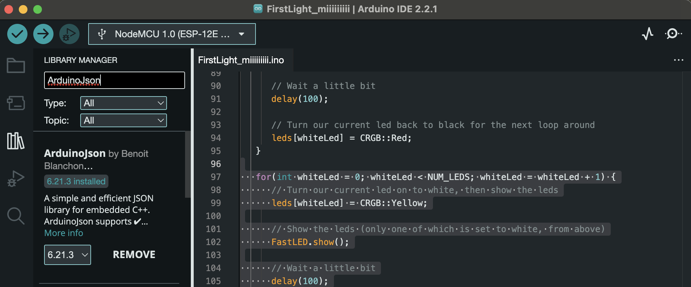
   

  <li>Met de volgende code kun je je ESP32 of ESP8266 NodeMCU GPIO's besturen door berichten te sturen naar een Telegram Bot. Om dit voor jou te laten werken, moet je je netwerkgegevens (SSID en wachtwoord), het Telegram Bot Token en je Telegram gebruikers-ID invoeren.</li>
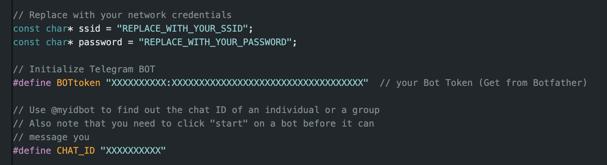
   

  <li>Upload de code naar je ESP32- of ESP8266-bord. Vergeet niet naar Extra > Board te gaan en het bord dat je gebruikt te selecteren. Ga naar Extra > Poort en selecteer de COM-poort waarop je board is aangesloten.

Nadat je de code hebt geüpload, druk je op de EN/RST-knop op het ESP32/ESP8266-bord zodat de code begint te lopen. Vervolgens kun je de Serial Monitor openen om te controleren wat er op de achtergrond gebeurt.

Ga naar je Telegram-account en open een conversatie met je bot. Stuur de volgende commando's en zie hoe de bot reageert:</li>

</ol>
<ul>
<li>/start shows the welcome message with the valid commands.</li>
<li>/led_on turns the LED on. </li>
<li>/led_off turns the LED off.</li>
<li>/state requests the current LED state.</li>
</ul>

Alle informatie komt van: https://randomnerdtutorials.com/telegram-control-esp32-esp8266-nodemcu-outputs/. 
